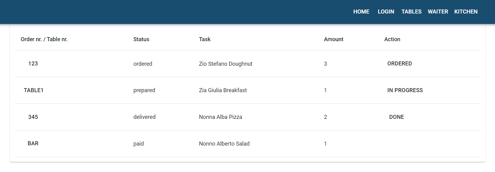

<p align="center">
</a>
</p>
<br>
  
# Pizzeria dashboard

Restaurant management project using database, React, Redux, working with API and Material Design.
It is an administrative panel of a pizzeria that offers views of login, tables, waiter, kitchen. In the application, it is possible to change the status of tables, create and edit orders, and handle orders by the kitchen.

[:sparkles: Published version](https://marcela-os.github.io/pizzeria-dashboard/kitchen)
- if the page does not load, wait a moment

## Tech Stack

- HTML
- CSS
- JavaScript
- React
- React Router
- Redux
- Material-UI

## Lessons

- how to create react app using [create-react-app](https://create-react-app.dev/)
- adapt the React project to the needs and requirements
- create application views using React Router
- Material-UI implementation in a React project
- work with API in React projects
- implement and use React Thunk
- use the Axios package to facilitate AJAX calling

## Room for Improvement

- further development of the application

## Run Locally

Install dependencies

```bash
  npm install // yarn install
```

Start the server

```bash
  npm run start // yarn start
```

## Available URLs

- http://localhost:3000 - current project, administrative panel (`webpack-dev-server`)
- http://localhost:3131 - restaurant website for customers
- http://localhost:3131/api - URL Api of the project
- http://localhost:3131/api/db - view the entire database in the API
- http://localhost:3131/panel - status of the current project (admin panel) from the moment of its launch `yarn start` (the page does not change live)

## Authors

:woman: [@marcelaos](https://github.com/marcela-os)
